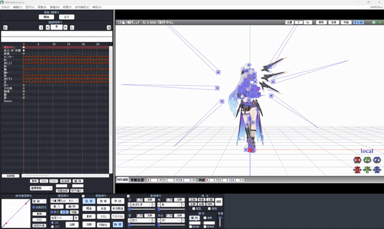

<div align="center">

# HY-Motion-MMD：文本生成 MMD 动作（VMD）

从一句英文文本，端到端生成可在 MikuMikuDance 中直接加载的 `.vmd` 动作文件。

基于 [Tencent Hunyuan HY-Motion 1.0](https://github.com/Tencent-Hunyuan/HY-Motion-1.0) 文生动作大模型 + 自研 SMPL→MMD 角色重定向与 VMD 导出工具链。

</div>

## 效果演示

**Prompt:** *A person walks forward slowly while looking around*

<div align="center">

</div>

---

## 目录

- [效果演示](#效果演示)
- [1. 项目简介](#1-项目简介)
- [2. 整体流程](#2-整体流程)
- [3. 目录结构](#3-目录结构)
- [4. 环境配置](#4-环境配置)
- [5. 模型权重下载](#5-模型权重下载)
- [6. 快速开始](#6-快速开始)
- [7. 运行方式详解](#7-运行方式详解)
- [8. 输出说明](#8-输出说明)
- [9. 常见问题](#9-常见问题)
- [10. 版权说明](#10-版权说明)
- [11. 致谢与引用](#11-致谢与引用)

---

## 1. 项目简介

**HY-Motion-MMD** 把腾讯混元 **HY-Motion 1.0** 文生 3D 动作大模型与一套 **SMPL → MMD 角色重定向 / VMD 导出工具链** 串联起来，只需要输入一句文本（如 *A person walks forward slowly.*），就能自动得到一个可在 MMD 中加载到 PMX 模型上播放的 `.vmd` 动作文件。

- **文本→动作**：HY-Motion 1.0（DiT + Flow Matching，1.0B 参数）
- **动作→MMD VMD**：SMPL FBX 转换 + MotionBuilder HIK 重定向 + Blender mmd_tools 导出
- **附带资产**：示例 PMX 模型与贴图、SMPL 模板 FBX、HIK 角色化模板（见 [版权说明](#10-版权说明)）

Pipeline 设计为**通用 MMD 工作流**：Stage 2 的重定向目标角色可在 `retarget/configs/characters_cfg.json` 中配置；仓库内默认附带一套示例角色资产用于演示全流程。

支持 macOS / Windows / Linux，CPU 也可运行（慢，需 15GB+ 内存加载 Qwen3-8B）。

---

## 2. 整体流程

```
 ┌────────────────────────────────────────────────────────────────────────┐
 │  Stage 0  文本 ──(HY-Motion 1.0)──▶  SMPL  .npz                       │
 │            ─ CLIP + Qwen3-8B 文本编码                                  │
 │            ─ 20 步 Flow Matching 扩散                                  │
 │            运行环境: 普通 Python (PyTorch)                              │
 └────────────────────────────────────────────────────────────────────────┘
                              │
                              ▼
 ┌────────────────────────────────────────────────────────────────────────┐
 │  Stage 1  .npz/.npy ──(run_reframe.py)──▶  SMPL ASCII .fbx            │
 │            运行环境: 普通 Python (numpy / PyYAML)                       │
 └────────────────────────────────────────────────────────────────────────┘
                              │
                              ▼
 ┌────────────────────────────────────────────────────────────────────────┐
 │  Stage 2  SMPL .fbx ──(mobupy + HIK)──▶  目标角色 ASCII .fbx          │
 │            运行环境: Autodesk MotionBuilder 的 mobupy.exe               │
 └────────────────────────────────────────────────────────────────────────┘
                              │
                              ▼
 ┌────────────────────────────────────────────────────────────────────────┐
 │  Stage 3  角色 ASCII .fbx ──(mobupy)──▶  角色 二进制 .fbx              │
 │            (Blender 不能读 ASCII FBX，需先转二进制)                      │
 └────────────────────────────────────────────────────────────────────────┘
                              │
                              ▼
 ┌────────────────────────────────────────────────────────────────────────┐
 │  Stage 4  角色 二进制 .fbx ──(Blender + mmd_tools)──▶  .vmd            │
 │            含尺度/接地修正，确保站立正确                                  │
 └────────────────────────────────────────────────────────────────────────┘
                              │
                              ▼
        在 MMD 里加载对应 PMX 模型 + 导出的 .vmd 即可播放
```

各阶段互相独立，通过子进程串联，可以单独运行某阶段调试（见 [运行方式详解](#7-运行方式详解)）。

---

## 3. 目录结构

```
HY-Motion_MMD/
├── README.md                          ← 本文件
├── README_HY_Motion_en.md             ← HY-Motion 官方 README（英文）
├── README_HY_Motion_zh_cn.md          ← HY-Motion 官方 README（中文）
├── License.txt
├── requirements.txt                   ← HY-Motion Python 依赖
├── .gitattributes                     ← LFS 规则（PMX/FBX/VMD 走 LFS）
├── .gitignore
│
├── hymotion/                          ← HY-Motion 文生动作核心包
│   ├── network/                       ←   DiT 网络 / 文本编码器
│   ├── pipeline/                      ←   body_model / motion_diffusion
│   ├── prompt_engineering/            ←   提示词重写（可选）
│   └── utils/                         ←   t2m_runtime / configs / loaders ...
│
├── local_infer.py                     ← HY-Motion 官方批量推理入口
├── gradio_app.py                      ← HY-Motion 官方 Gradio 演示
├── app.py                             ← ★ 本项目 Flask 网页 Demo（端到端）
│
├── stats/                             ← 动作统计量 Mean.npy / Std.npy
├── assets/                            ← 横幅/架构图 + wooden_models（SMPL mesh）
├── examples/
│   └── example_prompts/
│       ├── quick_test.txt             ← 单行一条 prompt 的样例
│       ├── example_subset.json        ← 官方子集
│       └── cpu_run/
│
├── ssae/                              ← SSAE 语义对齐评测（可选）
│
├── scripts/                           ← 工具脚本
│   ├── download_models.ps1            ← ★ Windows 一键下载模型权重
│   ├── download_models.sh             ← ★ Linux/macOS 一键下载模型权重
│   ├── download_text_encoders.ps1     ← 仅下载文本编码器
│   ├── pull_lfs_assets.ps1            ← 拉 LFS 资产
│   ├── verify_text_encoders.py        ← 校验文本编码器加载
│   ├── render_pmx_vmd.py              ← Blender 离线渲染 PMX+VMD → MP4
│   ├── run_full_qwen_batch.py         ← 全流程（含 Qwen3）批量推理
│   ├── run_walk_forward_slowly.py     ← ★ 单条 prompt 全流程示例
│   └── web_job_worker.py              ← app.py 的工作子进程
│
├── smpl_silverwolf_pipeline/          ← SMPL → MMD 重定向 / VMD 工具包
│   └── smpl_silverwolf_pipeline/
│       ├── README.md                  ←   详细工具包说明
│       ├── requirements.txt           ←   numpy / PyYAML
│       ├── run_pipeline.py            ← ★ 一体化编排器（Stage 1~4）
│       ├── pipeline_config.yaml       ← ★ 配置：可执行文件路径 / 各阶段参数
│       ├── fbx2npy2fbx/               ←   npy ↔ fbx 互转（含 SMPL 模板 FBX）
│       ├── retarget/                  ←   SMPL ↔ MMD 角色 重定向（mobupy）
│       │   ├── retarget.py
│       │   ├── mobu_retareting.py
│       │   ├── configs/characters_cfg.json
│       │   └── data/templates/
│       │       ├── SMPLX-lh-neutral/std.fbx
│       │       └── silver_wolf/std.fbx   ← 默认示例角色 HIK 模板
│       └── mmd/                       ←   MMD 模型与脚本（Blender + mmd_tools）
│           ├── fbx_to_vmd_custom.py    ←   ★ FBX → VMD 高保真导出
│           ├── fbx_ascii_to_binary.py
│           ├── pmx_to_fbx.py
│           ├── make_silver_wolf_template.py
│           ├── mmd_tools.zip           ←   开源 Blender 插件
│           └── model/                  ←   示例 PMX 模型资产（见版权说明）
│               ├── silver_wolf_lv999.pmx
│               ├── silver_wolf_lv999.fbx
│               └── *.png / *.bmp / *.tga
│
├── ckpts/                             ← 模型权重（需自行下载，见 §5）
│   └── README.md                      ←   下载说明
│
└── output/                            ← 运行产物（自动生成，不入库）
    └── demo_vmd/                      ←   已生成的示例 .vmd（可选保留）
```

带 ★ 的是最常用 / 最关键的入口。

---

## 4. 环境配置

整个 pipeline 涉及三种运行环境，建议分开装：

### 4.1 Python（Stage 0、1）

推荐 Python 3.10 + conda 环境：

```powershell
# 创建环境
conda create -n hymotion-mmd python=3.10 -y
conda activate hymotion-mmd

# 先按官方指引装 PyTorch（GPU 用户去 https://pytorch.org 选对应版本）
# CPU 用户：
pip install torch==2.5.1 torchvision==0.20.1 --index-url https://download.pytorch.org/whl/cpu

# 安装本项目依赖
pip install -r requirements.txt

# 网页 Demo 还需要 Flask
pip install flask

# 模型下载脚本需要 huggingface_hub
pip install huggingface_hub
```

`requirements.txt` 关键依赖（已固定版本）：

- `torch==2.5.1` / `torchvision==0.20.1`
- `transformers==4.53.3` / `accelerate==0.30.1` / `diffusers==0.26.3`
- `safetensors==0.5.3` / `einops==0.8.1`
- `numpy>=1.24.0,<2.0` / `scipy>=1.10.0` / `transforms3d==0.4.2`
- `PyYAML==6.0` / `omegaconf==2.3.0`
- `fbxsdkpy==2020.1.post2`（FBX SDK，Stage 1 用）

### 4.2 Autodesk MotionBuilder（Stage 2、3）

提供 `mobupy.exe` 用于跑 HIK 重定向和 FBX ASCII→二进制转换。

- 安装 **MotionBuilder 2027**（或 2024+）
- 在 `smpl_silverwolf_pipeline/smpl_silverwolf_pipeline/pipeline_config.yaml` 里把 `executables.mobupy` 指向你的安装路径，例如：
  ```yaml
  executables:
    mobupy: "C:/Program Files/Autodesk/MotionBuilder 2027/bin/x64/mobupy.exe"
  ```

### 4.3 Blender + mmd_tools（Stage 4、视频渲染）

- 安装 **Blender 4.2+**（脚本已在 5.1 上测试通过）
- 配置路径：
  ```yaml
  executables:
    blender: "C:/Program Files/Blender Foundation/Blender 5.1/blender.exe"
  ```
- 安装 `mmd_tools` 插件（一次性）：
  - Blender → Edit → Preferences → Add-ons → Install → 选择 `smpl_silverwolf_pipeline/smpl_silverwolf_pipeline/mmd/mmd_tools.zip` → 启用。
  - 脚本中模块名为 `bl_ext.user_default.mmd_tools`。

### 4.4 MikuMikuDance（可选，预览）

- 安装 MMD（如 MikuMikuDanceE_v932x64）
- 配置 `executables.mmd` 路径；不配也行，pipeline 结束会跳过自动启动 MMD

### 4.5 ffmpeg（可选，视频合成）

`app.py` 渲染 MP4 时优先用 ffmpeg；未安装会回退到 `imageio`。建议装上：

```powershell
winget install Gyan.FFmpeg
```

---

## 5. 模型权重下载

本仓库 **不附带** 以下大模型权重（合计 ~22GB），请用脚本下载到 `ckpts/`：

| 模型 | 仓库 ID | 大小 | 用途 |
|------|---------|------|------|
| HY-Motion-1.0     | `tencent/HY-Motion-1.0` (子目录 `HY-Motion-1.0/`) | ~4 GB  | 主文生动作 DiT |
| CLIP-Large        | `openai/clip-vit-large-patch14`                  | ~1.7 GB| 文本编码器（必装） |
| Qwen3-8B          | `Qwen/Qwen3-8B`                                  | ~16 GB | 高级文本编码器（必需） |

### Windows

```powershell
# 国内用户建议先设镜像
$env:HF_ENDPOINT = "https://hf-mirror.com"

powershell -ExecutionPolicy Bypass -File scripts/download_models.ps1
```

### Linux / macOS

```bash
export HF_ENDPOINT=https://hf-mirror.com   # 国内镜像，可选
bash scripts/download_models.sh
```

下载完成后，`ckpts/` 应该长这样：

```
ckpts/
├── tencent/
│   └── HY-Motion-1.0/
│       ├── config.yml
│       └── latest.ckpt
├── clip-vit-large-patch14/
│   ├── config.json
│   ├── model.safetensors
│   └── ...
└── Qwen3-8B/
    ├── config.json
    ├── model-00001-of-00005.safetensors
    ├── ...
    └── tokenizer.json
```

> **关于 Qwen3**：Qwen3-8B 是必需的文本编码器（不使用会导致生成效果明显变差）。CPU 推理时加载 Qwen3-8B 需要约 15GB+ 系统内存；内存不足会被 Windows 直接杀进程，建议关闭其它占内存程序或换更大内存的机器。

---

## 6. 快速开始

最简单的方式：用 `app.py` 启动网页 Demo，浏览器里输入文本即可。

```powershell
conda activate hymotion-mmd
$env:USE_HF_MODELS = "0"        # 用本地 ckpts/ 加载，不走 HuggingFace 在线
python app.py
```

浏览器自动打开 `http://127.0.0.1:7860/`，输入框默认就是 `A person walks forward slowly.`，点 **开始生成**，等流水线跑完即可看到渲染视频，并在 MMD 中加载 PMX+VMD。

---

## 7. 运行方式详解

### 7.1 命令行：单条 prompt 全流程

`scripts/run_walk_forward_slowly.py` 是一个最小示例，直接跑出 `.vmd` 动作文件：

```powershell
conda activate hymotion-mmd
python scripts/run_walk_forward_slowly.py
```

它会依次执行 Stage 0~4，最终把 `.vmd` 复制到仓库根目录。

### 7.2 命令行：批量 prompt

```powershell
# 用 Qwen3 文本编码器（高内存，约 15GB+）
python scripts/run_full_qwen_batch.py
```

修改脚本里的 `PROMPTS` 列表即可自定义 prompt。

### 7.3 HY-Motion 官方批量推理

仅跑 Stage 0（文本→SMPL npz），不做 MMD 重定向：

```powershell
python local_infer.py --model_path ckpts/tencent/HY-Motion-1.0 `
    --input_text_dir examples/example_prompts/ `
    --output_dir output/local_infer `
    --disable_rewrite --disable_duration_est
```

详见 `README_HY_Motion_zh_cn.md`。

### 7.4 仅跑后段（已有 .npz）

把 `.npz` 放进 `output_pipeline/00_npz/`，然后：

```powershell
cd smpl_silverwolf_pipeline/smpl_silverwolf_pipeline
python run_pipeline.py --stages 1,2,3,4
```

### 7.5 单独跑某阶段（调试）

```powershell
python run_pipeline.py --stages 2      # 只跑 SMPL→角色 重定向
python run_pipeline.py --stages 4      # 只跑 FBX→VMD
python run_pipeline.py --stages all    # 全跑
```

### 7.6 Gradio 演示（仅文本→动作可视化）

```powershell
python gradio_app.py
```

只展示 HY-Motion 文本→动作的可视化，不包含 MMD 重定向和 VMD 导出。

### 7.7 更换目标 MMD 角色

1. 在 `retarget/configs/characters_cfg.json` 中注册新角色（HIK 模板、骨骼映射等）
2. 修改 `pipeline_config.yaml` 中 `retarget.target` 与 `vmd.pmx_model` 指向新角色
3. 重新跑 Stage 2~4

---

## 8. 输出说明

完整 pipeline 跑完后，产物落在 `smpl_silverwolf_pipeline/smpl_silverwolf_pipeline/output_pipeline/`：

```
output_pipeline/
├── 00_npz/             Stage 0 产出：SMPL .npz
├── 01_smpl_fbx/        Stage 1 产出：SMPL ASCII .fbx
├── 02_silverwolf_fbx/  Stage 2 产出：目标角色 ASCII .fbx
├── 03_silverwolf_bin/  Stage 3 产出：目标角色 二进制 .fbx
└── 04_vmd/             Stage 4 产出：.vmd ★ 最终产物
```

`app.py` 还会在 `output/web_videos/<job_id>.mp4` 放渲染视频。

仓库自带的 `output/demo_vmd/` 里给出了几条 prompt 的示例 `.vmd`，可直接拖进 MMD 试播。

### 在 MMD 中播放

1. 打开 MikuMikuDance
2. 文件 → 加载模型 → 对应 PMX 模型（默认示例见 `mmd/model/silver_wolf_lv999.pmx`）
3. 文件 → 加载动作 → 上一步生成的 `.vmd`
4. 播放

---

## 9. 常见问题

### Q1：CPU 推理太慢？
A：HY-Motion 1.0 官方约需 26GB 显存。CPU 模式 20 步扩散 + Qwen3 编码大约 5–30 分钟一条 prompt。如果有 ≥30GB 显存的 NVIDIA GPU，把 `app.py` 里的 `HY_MOTION_DEVICE` 改成 `cuda` 即可。

### Q2：进程跑到一半被系统杀掉，没有报错？
A：典型是 Windows OOM。加载 Qwen3-8B 约需 15GB+ 内存。请关闭其它占内存程序，或换更大内存的机器。

### Q3：Stage 2 报「找不到 mobupy」？
A：编辑 `smpl_silverwolf_pipeline/smpl_silverwolf_pipeline/pipeline_config.yaml`，把 `executables.mobupy` 指向你机器上的 `mobupy.exe` 实际路径。

### Q4：Stage 4 报「mmd_tools 未安装」？
A：Blender → Preferences → Add-ons → Install → 选 `mmd/mmd_tools.zip` 并启用。

### Q5：Stage 4 报「找不到 PMX 模型」？
A：确认 `pipeline_config.yaml` 里 `vmd.pmx_model` 指向的 PMX 文件存在。

### Q6：生成的 VMD 在 MMD 里人物漂浮 / 沉地下？
A：`fbx_to_vmd_custom.py` 已经做了接地（grounding）修正。如果还有问题，可运行 `mmd/verify_standing.py` 校验，或检查源 `.npz` 是否存在异常根位移。

### Q7：GitHub 仓库要不要把 ckpts/ 提交上去？
A：**不要**。`.gitignore` 已默认忽略 `ckpts/` 下所有权重。请用 `scripts/download_models.*` 下载。仓库内 LFS 只用于 PMX/FBX/VMD/贴图等项目资产。

---

## 10. 版权说明

仓库内附带的示例 MMD 角色模型 **Silver Wolf LV.999**（`silver_wolf_lv999.pmx` 及相关贴图、FBX 文件）的版权归 **miHoYo**（米哈游）所有。

该模型文件下载自：[崩坏：星穹铁道版本激励计划](https://www.bilibili.com/blackboard/era/5fZBAcFlCEz8DxWr.html)

**本项目与 miHoYo 无任何官方关联**，模型资产仅作为 pipeline 演示与测试用途随仓库提供。使用者请遵守 miHoYo 及原发布渠道的相关使用条款，不得将模型用于任何商业用途或违反版权方的行为。

如需替换为自己的 MMD 角色，请参考 [§7.7 更换目标 MMD 角色](#77-更换目标-mmd-角色)，自行准备合法授权的 PMX 模型与 HIK 重定向模板。

---

## 11. 致谢与引用

本项目基于以下开源工作：

- [HY-Motion 1.0](https://github.com/Tencent-Hunyuan/HY-Motion-1.0) — Tencent Hunyuan 3D Digital Human Team
- [SMPL](https://smpl.is.tue.mpg.de/) / [SMPLH](https://mano.is.tue.mpg.de/)
- [CLIP](https://github.com/openai/CLIP) / [Qwen3](https://github.com/QwenLM/Qwen3)
- [PyTorch3D](https://github.com/facebookresearch/pytorch3d) / [kornia](https://github.com/kornia/kornia) / [transforms3d](https://github.com/matthew-brett/transforms3d)
- [FBX-SDK](https://www.autodesk.com/developer-network/platform-technologies/fbx-sdk-2020-0)
- [GVHMR](https://zju3dv.github.io/gvhmr/) / [HunyuanVideo](https://github.com/Tencent-Hunyuan/HunyuanVideo)
- [mmd_tools](https://github.com/UuuNyaa/mmd_tools) — Blender MMD 插件

如果本项目对你有帮助，请一并引用 HY-Motion 原始报告：

```bibtex
@article{hymotion2025,
  title={HY-Motion 1.0: Scaling Flow Matching Models for Text-To-Motion Generation},
  author={Tencent Hunyuan 3D Digital Human Team},
  journal={arXiv preprint arXiv:2512.23464},
  year={2025}
}
```
