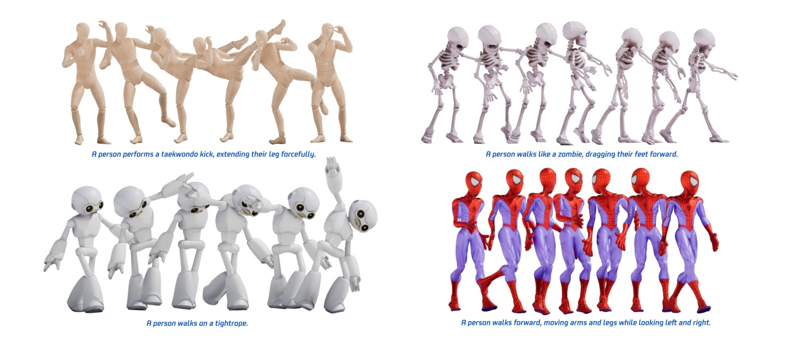
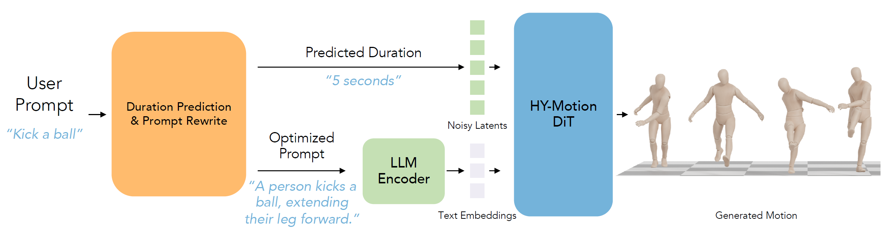
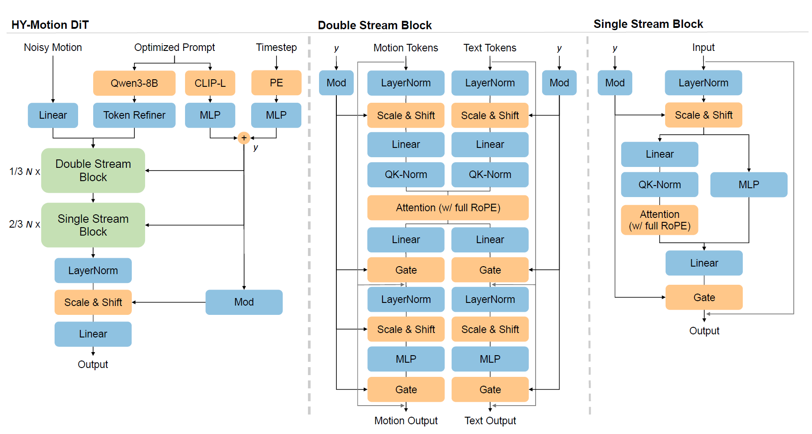
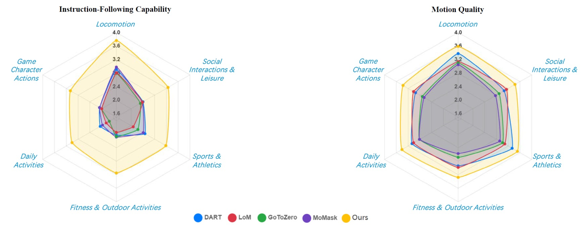

[English](README.md)


<p align="center">
  
</p>

<div align="center">
  <a href="https://aistudio.tencent.com/motion" target="_blank">
    
  </a>
  <a href="https://github.com/Tencent-Hunyuan/HY-Motion-1.0" target="_blank">
    
  </a>
  <a href="https://huggingface.co/spaces/tencent/HY-Motion-1.0" target="_blank">
    
  </a>
  <a href="https://huggingface.co/tencent/HY-Motion-1.0" target="_blank">
    
  </a>
  <a href="https://arxiv.org/pdf/2512.23464" target="_blank">
    
  </a>
  <a href="https://x.com/TencentHunyuan" target="_blank">
    
  </a>
</div>


# HY-Motion 1.0：基于流匹配的3D动作生成大模型


<p align="center">
  
</p>


## 🔥 最新消息
- **2026年1月29日**: 📊 我们发布了 **SSAE** (Structured Semantic Alignment Evaluation) 评测指令和代码，这是一种基于 VLM 评估视频生成语义对齐度的方法。欢迎前往 `ssae` 目录查看使用详情！
- **2025年12月30日**: 🤗 我们发布了 [HY-Motion 1.0](https://huggingface.co/tencent/HY-Motion-1.0) 的推理代码和预训练模型。欢迎通过我们的 [HuggingFace Space](https://huggingface.co/spaces/tencent/HY-Motion-1.0) 和 [官方网站](https://hunyuan.tencent.com/motion) 进行试用！


## **简介**

**HY-Motion 1.0** 是一系列基于 Diffusion Transformer (DiT) 和流匹配 (Flow Matching) 技术的文生3D人体动作生成模型。开发者可以通过简单的文本描述，快速生成基于骨骼的3D角色动画，并可直接应用于各类3D动画制作流程中。该系列模型首次将文生动作领域的DiT模型参数规模提升至十亿级别，使其在指令遵循能力和动作生成质量上，均显著优于现有的开源模型。

### 核心特性

- **业界顶尖的性能**：在指令遵循能力和生成动作质量方面均达到了业界最先进的水平。

- **十亿级参数模型**：我们率先将DiT模型在文生动作领域扩展至十亿参数规模，实现了更强的指令理解与遵循能力，效果领先于同类开源模型。

- **先进的三阶段训练**：模型训练采用了一个完整的三阶段流程：

    - *大规模预训练*：在超过3000小时的多样化动作数据上进行，学习广泛的动作先验知识。

    - *高质量微调*：在400小时的精选高质量3D动作数据上进行，提升动作的细节与流畅度。

    - *强化学习*：通过人类反馈和奖励模型进行强化学习，进一步优化模型的指令遵循能力和动作的自然度。


<p align="center">
  
</p>

<p align="center">
  
</p>

<p align="center">
  
</p>


## 🎁 模型库 (Model Zoo)


**HY-Motion-1.0 系列**

| 模型 | 描述 | 日期 | 大小 | Huggingface | GPU显存最少占用 |
|:-------|:-------------|:------:|:------:|:-------------:|:-------------:|
| **HY-Motion-1.0** | 标准文生动作模型 | 2025-12-30 | 1.0B | [下载](https://huggingface.co/tencent/HY-Motion-1.0/tree/main/HY-Motion-1.0) | 26GB |
| **HY-Motion-1.0-Lite** | 轻量级文生动作模型 | 2025-12-30 | 0.46B | [下载](https://huggingface.co/tencent/HY-Motion-1.0/tree/main/HY-Motion-1.0-Lite) | 24GB |

*注*: 如果要减少GPU显存占用，可以使用以下配置: `--num_seeds=1`, 文本输入不超过30个单次, 动作长度不超过5秒.  

## 🤗 快速上手 HY-Motion 1.0

HY-Motion 1.0 支持 macOS、Windows 和 Linux 系统。

- [代码使用 (命令行)](#代码使用-命令行)
- [Gradio 应用](#gradio-应用)


#### 1. 安装依赖

首先，请通过 [官方网站](https://pytorch.org/) 安装 PyTorch。然后安装依赖项：

```bash
git clone https://github.com/Tencent-Hunyuan/HY-Motion-1.0.git
cd HY-Motion-1.0/
# 请确认已经安装git-lfs
git lfs pull
pip install -r requirements.txt
```

#### 2. 下载模型权重
请按照 [ckpts/README.md](ckpts/README.md) 中的说明下载必要的模型权重。


### 代码使用 (命令行)

我们提供了用于本地批量推理的脚本，适合处理大量提示词。

```bash
# HY-Motion-1.0
python3 local_infer.py --model_path ckpts/tencent/HY-Motion-1.0

# HY-Motion-1.0-Lite
python3 local_infer.py --model_path ckpts/tencent/HY-Motion-1.0-Lite
```

**常用参数:**
- `--input_text_dir`: 包含 `.txt` 或 `.json` 格式提示词文件的目录。
- `--output_dir`: 结果保存目录 (默认: `output/local_infer`)。
- `--disable_duration_est`: 禁用基于 LLM 的时长预估。
- `--disable_rewrite`: 禁用基于 LLM 的提示词重写。
- `--prompt_engineering_host` / `--prompt_engineering_model_path`: （可选）动作时长预测和提示词重写模块的主机地址/本地路径。
    - **下载地址**: 您可以从 [此处](https://huggingface.co/Text2MotionPrompter/Text2MotionPrompter) 下载动作时长预测和提示词重写模块。
    - **注意**: 如果您**不**设置此参数，则必须同时设置 `--disable_duration_est` 和 `--disable_rewrite`。否则，脚本将因无法访问重写服务而报错。

### Gradio 应用

您可以在本地计算机上启动 [Gradio](https://www.gradio.app/) Web 界面进行交互式可视化：

```bash
python3 gradio_app.py
```

运行命令后，打开浏览器访问 `http://localhost:7860`


## Prompt输入规范建议

1. 请使用英文输入，尽量在60个单词以内。
   
2. 支持对动作进行简单描述，或对人体四肢、躯干动作的详细描述。
   
3. 暂不支持以下内容：
 - ❌动物或非人形动画；
 - ❌对角色的情绪或外观描述；
 - ❌对物体、场景的描述；
 - ❌多人动画生成；
 - ❌循环/原地动画生成。

4. Prompt参考案例：
 - A person performs a squat, then pushes a barbell overhead using the power from standing up.
 - A person climbs upward, moving up the slope.
 - A person stands up from the chair, then stretches their arms.
 - A person walks unsteadily, then slowly sits down.


## 🔗 引用 (BibTeX)

如果您觉得本仓库对您有帮助，请引用我们的报告：

```bibtex
@article{hymotion2025,
  title={HY-Motion 1.0: Scaling Flow Matching Models for Text-To-Motion Generation},
  author={Tencent Hunyuan 3D Digital Human Team},
  journal={arXiv preprint arXiv:2512.23464},
  year={2025}
}
```

## 致谢

我们要感谢 [FLUX](https://github.com/black-forest-labs/flux), [diffusers](https://github.com/huggingface/diffusers), [HuggingFace](https://huggingface.co), [SMPL](https://smpl.is.tue.mpg.de/)/[SMPLH](https://mano.is.tue.mpg.de/), [CLIP](https://github.com/openai/CLIP), [Qwen3](https://github.com/QwenLM/Qwen3), [PyTorch3D](https://github.com/facebookresearch/pytorch3d), [kornia](https://github.com/kornia/kornia), [transforms3d](https://github.com/matthew-brett/transforms3d), [FBX-SDK](https://www.autodesk.com/developer-network/platform-technologies/fbx-sdk-2020-0), [GVHMR](https://zju3dv.github.io/gvhmr/) 和 [HunyuanVideo](https://github.com/Tencent-Hunyuan/HunyuanVideo) 仓库或工具的贡献者们，感谢他们的开放研究与探索。
